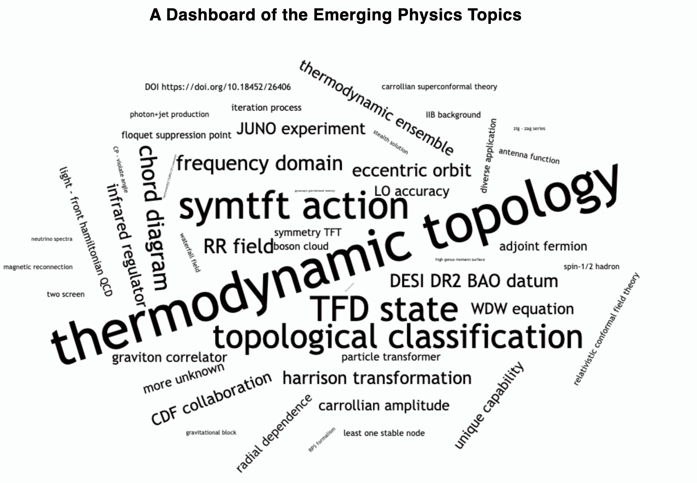

# Visualise High-Energy Physics

A personal project exploring whether emerging trends in high-energy physics can be identified from arXiv paper metadata.



[Live Plotly Dash app](https://3e38fea6-fe42-4acc-9db1-2496573e0b93.plotly.app/)

## What it does

```text
fetch_arxiv.py  →  extract_phrases.py  →  cluster_phrases.py  →  trend_analysis.py
  (arXiv API)       (spaCy noun chunks)     (semantic clustering)    (trend analysis)
```

The pipeline:

1. Downloads HEP paper metadata from arXiv.
2. Extracts candidate topics from titles and abstracts.
3. Groups similar phrases into topic clusters using SentenceTransformers and HDBSCAN.
4. Ranks clusters by growth in relative frequency to highlight emerging research areas.

## Status

An early-stage independent prototype exploring how much can be learned about research trends from preprint metadata alone.

## Future work

* Improve phrase similarity and clustering accuracy.

## Disclaimer

This is an exploratory personal project. Topic clusters are machine-generated and should be treated as indicative, not authoritative.
